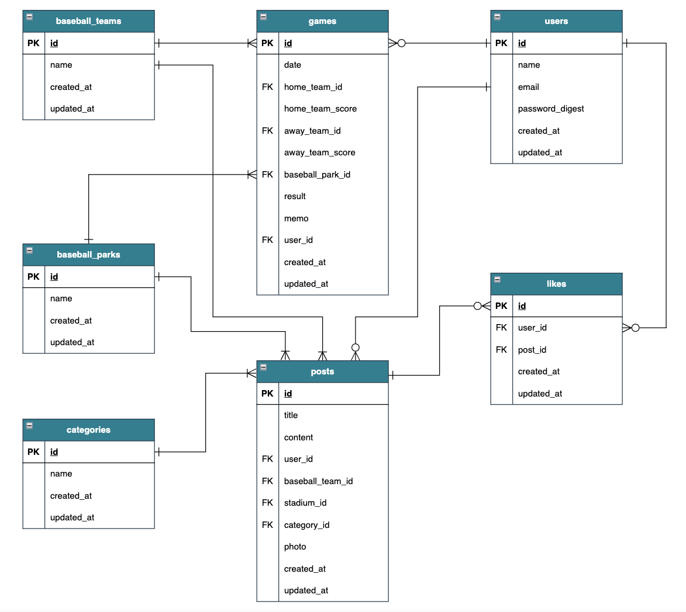
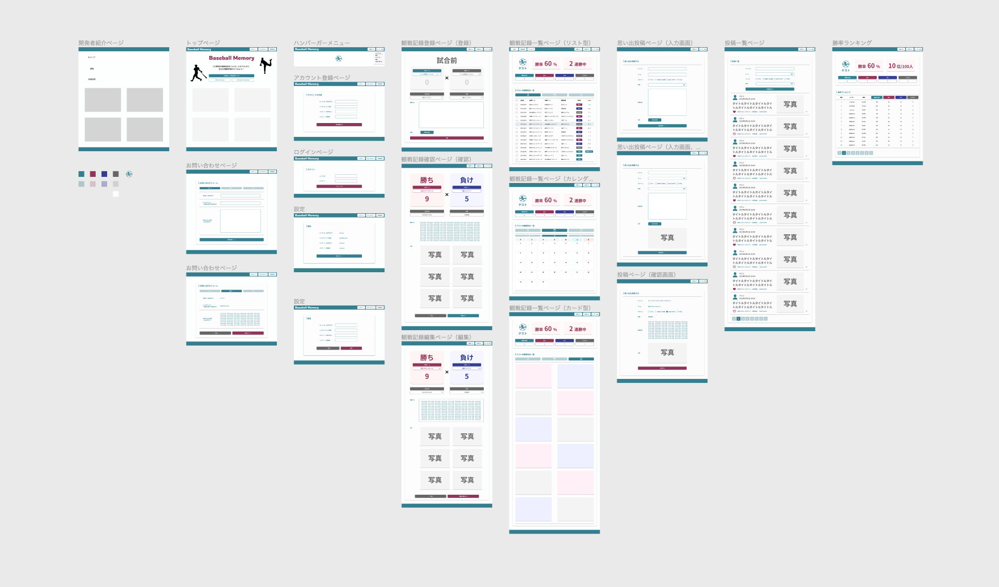

# Baseball Memory

# アプリケーションの概要

プロ野球の観戦記録に特化したアプリです。

観戦結果に応じてあなたの勝率などを算出できます。

# 想定しているユーザー

- 頻繁にプロ野球を観戦しに行く方
- 中長期的にプロ野球を観戦している方
- 自分が観戦した試合の結果を後で振り返りたい方

# アプリケーション詳細

- プロ野球の観戦記録をつけることができる
- どのくらい試合を見に行ったか、勝ったか、負けたかなどをが一目で確認できる
- 観戦結果に応じて勝率や連勝記録などを算出される
- 思い出を投稿することができる

# 実装機能一覧

- ユーザーアカウント作成、修正
- ユーザーログイン、ログアウト
- 観戦記録登録、編集、削除
- 観戦結果に基づいて勝率や連勝記録などを表示する機能
- 観戦記録の一覧表示（リスト型、カレンダー型）
- 思い出の投稿、編集、削除
- 思い出へのいいね機能
- ゲストログイン機能

# 開発スケジュール

| 開始日 | 終了日 | 工数 | タスク                  |
| ------ | ------ | ---- | ----------------------- |
| 4/24   | 4/30   | 1w   | アイデア出し            |
| 5/1    | 5/3    | 3d   | デザイン検討            |
| 5/3    | 5/4    | 2d   | テーブル設計、ER 図作成 |
| 5/3    | 5/4    | 2d   | 技術選定                |
| 5/3    | 5/4    | 2d   | 開発環境構築            |
| 5/3    | 6/5    | 4w   | 開発、実装              |
| 6/5    | 6/11   | 1w   | テスト実装              |
| 6/12   | 6/16   | 1w   | 軽微修正                |

# 利用技術

| バックエンド                                         | version | 備考                             |
| ---------------------------------------------------- | ------- | -------------------------------- |
| Ruby                                                 | v3.1.4  | バックエンドの開発言語として採用 |
| （Ruby を中心に学習してきたため）                    |
| Ruby on Rails                                        | v6.1.7  | MVC フレームワークとして採用     |
| （バックエンドの開発言語に Ruby を選択しているため） |
| MySQL                                                | v8.0.0  | データベースとして採用           |

| フロントエンド                                         | version | 備考                                          |
| ------------------------------------------------------ | ------- | --------------------------------------------- |
| Bootstrap                                              | v5.0    | フロントエンドの CSS フレームワークとして採用 |
| （手軽に導入・利用できるため（学習コストがほぼなし）） |

| インフラ、その他 | version | 備考                                                                                   |
| ---------------- | ------- | -------------------------------------------------------------------------------------- |
| Heroku           | －      | デプロイ先に使用                                                                       |
| AWS S3           | －      | 画像の保存先として使用                                                                 |
| Docker           | v23.0.5 | 開発、本番の環境差分をなくすため、また、ローカル開発環境の構築をスムーズに行うため採用 |
| docker-compose   | v2.17.3 | 複数のコンテナを同時に立ち上げて管理するために使用                                     |
| phpMyAdmin       | v5.2.1  | データベースの値などを手軽に確認、変更するためのツールとして採用                       |
| GitHub           | －      | ソースコード管理に使用                                                                 |

# コミットメッセージの種別

基本的に、以下のルールに基づいてコミットしています。

| prefix | 説明                                         |
| ------ | -------------------------------------------- |
| add    | ファイル追加（ファイル追加、gem の追加など） |
| gem    | gem の追加、修正                             |
| feat   | 新規機能追加                                 |
| update | 修正（仕様変更、デザイン変更など）           |
| fix    | バグ修正                                     |
| spec   | テストコードの記載、修正                     |
| remove | ファイル削除                                 |
| clean  | リファクタリング、コメント挿入など           |

# ER 図

# デザイン

Figma で簡単なデザインを作成してからアプリケーションの実装に着手しました。

概ねデザイン通りに実装したつもりですが、変更しながら実装したため、完全に一致はしていないです。

## [Figma](https://www.figma.com/file/Jar5dZynnuTNm4YbxjvFqj/app-baseball-memory?type=design&node-id=0-1&t=etcqkTHsK1ZNxLbM-0)

# その他利用ツール、サービス

| ツール  | 備考                                                             |
| ------- | ---------------------------------------------------------------- |
| Figma   | 簡単なデザインイメージを作成するために使用                       |
| Draw.io | ER 図を作成するために使用                                        |
| Notion  | アイデア出し、要件定義、テーブル設計などのドキュメント管理に使用 |
| Canva   | ファビコンを作成するために使用                                   |

# 今後の予定

## 追加していきたい機能

- 全ユーザーの勝率のランキング表示（自分を一覧に表示するか切り替え可能）
- 勝率や試合数に応じて一言コメント出したり称号獲得したりする機能
  （「あなたは勝利の女神ですね ♪」のような）
- 勝率算出の範囲を設定する機能
- ユーザープロフィールの充実（アイコン、自己紹介、好きなチームや選手）
- 各ユーザーのプロフィールや思い出一覧、勝率などが一覧で表示される
- ユーザーをフォローする機能
- 友人同士でグループを作り、勝率を競う機能
- 思い出投稿に対するコメント機能（Twitter のような）
- 思い出投稿の保存、保存した投稿一覧表示
- 思い出投稿に紐づいているタグを押下して検索できる機能
- プロ野球の試合日程を閲覧
- パスワードリセット
- 運営への問い合わせ

## 技術的に取り組みたいこと

- インフラを Heroku から AWS 環境に移行
- Rails の api モードに置き換える
- モダンフロントエンドの導入
  React を想定し、CSS フレームワークは MUI、tailwindcss、ChakraUI のいずれかを使用想定
- デプロイ自動化（GitHub Actions の導入）
- GA4 の導入
- 何かしらの API 連携を活用した機能の導入
